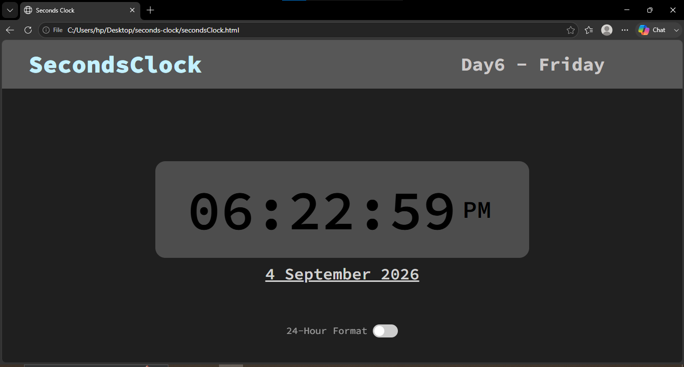
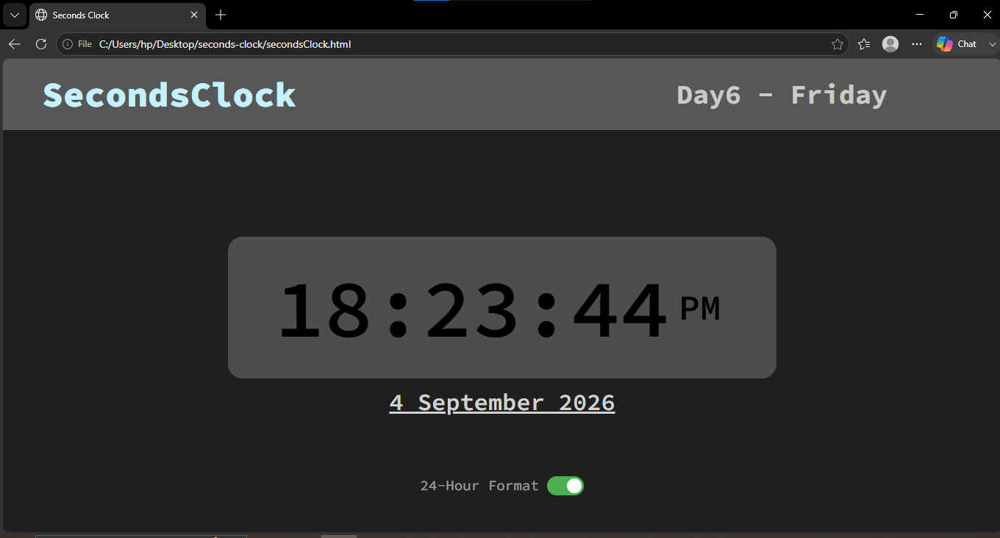

# seconds-clock
A simple, minimal clock built with HTML, CSS, and JavaScript that displays the current time with a live seconds counter.
# ⏱️ Seconds Clock

A clean, real-time digital clock built with vanilla HTML, CSS, and JavaScript. No frameworks, no dependencies — just the basics done well.

  

## 🚀 Demo

[Live Demo](#) <!-- add your GitHub Pages / Netlify link here -->

## ✨ Features

- Real-time updates every second using `setInterval`
- Displays hours, minutes, and seconds in a clean layout
- Fully responsive design
- Zero dependencies — pure HTML/CSS/JS

## 🛠️ Tech Stack

| Layer | Tech |
|-------|------|
| Structure | HTML5 |
| Styling | CSS3 |
| Logic | JavaScript (ES6) |

## 📦 Installation

Clone the repo and open it locally — no build tools required:

```bash
git clone https://github.com/your-username/seconds-clock.git
cd seconds-clock
```

Then just open `index.html` in your browser, or use a live server extension in VS Code for auto-reload.

## 📁 Project Structure
seconds-clock/
├── index.html
├── style.css
├── script.js
└── README.md


## 🧠 What I Learned

Building this helped me practice working with `Date()` objects, DOM manipulation, and timed updates using `setInterval()` in vanilla JavaScript.

## 📄 License

This project is open source and available under the [MIT License](LICENSE).

## Screenshot



